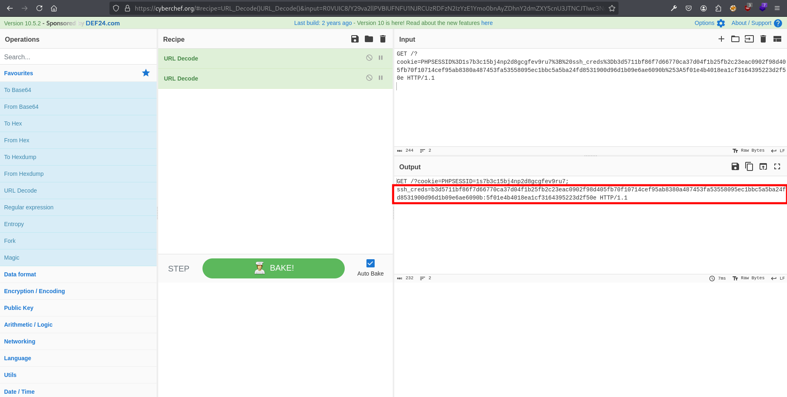

= Soberbia
:author: Manuel L. Quero
:toc: left
:doctype: book

<<<

== Escenario final

En esta máquina pondremos en práctica todos los conceptos aprendidos previamente. Será una prueba final diseñada para aplicar los conocimientos adquiridos. El objetivo es lograr la escalada de privilegios hasta obtener acceso como root, partiendo de un entorno que, aunque vulnerable, se asemeja a uno real. Será necesario realizar primero un reconocimiento, seguido de la ejecución de distintos tipos de ataques. Se fomenta la exploración libre, sin seguir guías preestablecidas; no obstante, proporcionaré algunas pistas para avanzar en caso de ser necesario.

<<<

== Solucionar la máquina

En esta guía se darán pistas, principalmente herramientas y cómo usarlas. Mucha suerte.

=== Despliegue de la máquina

Como requisito, necesitaremos tener instalado docker y docker-compose.

Podemos ver como instalar docker para varias distribuciones de linux -> https://docs.docker.com/engine/install/[Instalar Docker]

Podemos ver como instalar docker-compose para varias distribuciones de linux -> https://docs.docker.com/compose/install/linux/[Instalar Docker-Compose]

Necesitaremos descargar primeramente el auto_deploy.sh, el cual se muestra como una pirámide en la página. Después deberemos meter en un directorio tanto el auto_deploy.sh como el archivo de soberbia.tar, y ejecutar los siguientes comandos.

(Si el auto_deploy no tiene permisos se los damos mediante *chmod +x*). 

[source,bash]
----
$ sudo bash auto_deploy.sh soberbia.tar
----

=== Reconocimiento

==== Fase 1

Empezaremos conociendo los puertos que tiene abiertos el servidor.

.Pista 1
[%collapsible]
====
Para ello haremos uso primeramente de https://nmap.org/man/es/index.html[nmap].

[source,bash]
----
sudo nmap -p- --open -sS --min-rate 5000 -vvv -n -Pn (IP) -oG allPorts
----

* *sudo* -> Necesario porque -sS (SYN scan) requiere privilegios.
* *nmap* -> Llama a la herramienta Nmap.
* *-p-* -> Escanea todos los 65535 puertos TCP (no solo los comunes).
* *--open* -> Muestra solo los puertos abiertos (oculta filtrados/cerrados).
* *-sS* -> SYN scan (stealth scan). Muy rápido y difícil de detectar.
* *--min-rate 5000* -> Fuerza a Nmap a enviar al menos 5000 paquetes por segundo, lo que acelera el escaneo.
* *-vvv* -> Muestra información muy detallada durante el escaneo.
* *-n* -> No resuelve nombres de host (más rápido).
* *-Pn* -> No hace ping; asume que el host está activo (útil si ICMP está bloqueado).
* *(IP)* -> La dirección IP del objetivo.
* *-oG allPorts* -> Guarda los resultados en formato grepable (fácil de extraer con grep o awk) en el archivo allPorts.

[.text-center]

Como podemos ver están abiertos los puertos 80 y 22
====

.Pista 2
[%collapsible]
====
Podemos ver sus versiones con el siguiente comando:

[source,bash]
----
nmap -p (PORTS) -sC -sV (IP) 
----

* *-p (PORTS)* -> Indica los puertos que quieres escanear. Puedes poner un solo puerto (80), varios (22,80,443) o un rango (1-1000).
* *-sC* -> Usa los scripts por defecto de Nmap (los más comunes y seguros). Es similar a usar --script=default. Esto ayuda a detectar servicios, banners, configuraciones inseguras, etc.
* *-sV* -> Hace una detección de versión: intenta identificar el software y su versión en cada puerto abierto (por ejemplo, Apache 2.4.57).
* *(IP)* -> La dirección IP del objetivo.

[.text-center]

Una vez identificadas las versiones de los servicios, podemos comprobar si están desactualizadas y si presentan vulnerabilidades conocidas (CVEs) que podamos explotar.
====

.Sugerencia
[%collapsible]
====
Generalmente, los exploits se encuentran en repositorios como GitHub o en bases de datos especializadas como Exploit-DB. Para facilitar esta búsqueda, podemos utilizar herramientas como *https://www.exploit-db.com/searchsploit[searchsploit]*, que permite consultar Exploit-DB desde la terminal y verificar si existen exploits públicos para una versión específica.

[.text-center]

Podemos observar que no se ha encontrado ningún exploit relevante en Exploit-DB. Es importante ser precisos con los términos de búsqueda, ya que searchsploit devuelve todos los resultados relacionados, aunque no estén directamente vinculados con nuestros servicios. Por este motivo puede aparecer algún resultado, pero no necesariamente se aplica a nuestro caso.
====

==== Fase 2

Cómo ya hemos podido conocer, se trata de una página web sin certificado y con una conexión ssh, por lo que vamos a empezar analizando la página.

[.text-center]

.Pista 3
[%collapsible]
====
Aparentemente se ve una página que no tiene nada, pero es muy posible que posea directorios y subdirectorios con archivos. Para conocer la estructura vamos hacer lo que se denomina como fuzzing de contenido, es muy útil para identificar rutas sensibles como /admin, /backup, /config.php, etc. En nuestro caso usaremos https://www.kali.org/tools/feroxbuster/[feroxbuster] y https://www.kali.org/tools/gobuster/[gobuster], y compararemos.

[source,bash]
----
feroxbuster -u http://(IP) -w /usr/share/wordlists/dirbuster/directory-list-2.3-medium.txt --depth 0 --timeout 5
----

* *-u http://(IP)* -> Define la URL objetivo. Puedes sustituir (IP) por una dirección IP o dominio.
* *-w /usr/share/wordlists/dirbuster/directory-list-2.3-medium.txt* -> Especifica el diccionario que se usará para generar las rutas a probar (en este caso, uno mediano del paquete de DirBuster).
* *--depth 0* -> Recursividad infinita.
* *--timeout 5* -> Define un tiempo de espera de 5 segundos por solicitud antes de que feroxbuster la descarte por falta de respuesta.

[.text-center]

====

.Pista 4
[%collapsible]
====
[source,bash]
----
gobuster dir -u (IP) -w /usr/share/wordlists/dirbuster/directory-list-2.3-medium.txt 
----

* *dir* -> Le especificamos que queremos buscar directorios
* *-u (IP)* -> Define la URL objetivo. Puedes sustituir (IP) por una dirección IP o dominio.
* *-w /usr/share/wordlists/dirbuster/directory-list-2.3-medium.txt* ->  Especifica el diccionario que se usará para generar las rutas a probar (en este caso, uno mediano del paquete de DirBuster).

Gobuster es bastante sencillo de usar, pero un defecto que tiene es que no permite recursividad, teniendo que usar scripts para que haga dicha recursividad. Sinceramente veo feroxuster como una mejora de este.

[.text-center]

====

==== Fase 3

.Pista 5
[%collapsible]
====
Bueno, una vez conociendo la estructura, podemos apreciar que hay un directorio en /dev, que se llama pruebas, o un alias de esta ruta que es /devzone. Esto nos sugiere que los desarrolladores podrían estar utilizando esta ruta para realizar pruebas antes de lanzar la versión final del sitio web. Es común que estas zonas contengan código en desarrollo o funcionalidades no protegidas, lo que podría representar una posible vía de explotación.

[.text-center]

====

.Pista 6
[%collapsible]
====
Dentro de login.php podemos analizar las tecnologías con *wappalyzer* o con *whatweb* y ver que tecnologías usa.

[.text-center]

====

.Pista 7
[%collapsible]
====
[source,bash]
----
whatweb -a 3 -v http://172.17.0.2/1/2/4/23/dev/pruebas/login.php
----

[.text-center]

====

=== Ataque

==== Fase 4

Conociendo un poco más a lo que nos enfrentamos, al ser un login podemos probar con ciertos vectores.

.Pista 8
[%collapsible]
====
Efectivamente con SQLi, pero esta vez no lo vamos a hacer manual, obviamente hay formas más eficientes cómo *sqlmap*, donde comenzaremos por un reconocimiento sabiendo si es vulnerable a SQLi.

[source,bash]
----
sqlmap -u "http://172.17.0.2/1/2/4/23/dev/pruebas/login.php" --data "usuario=admin&password=admin" --batch --risk=3 --level=5 --technique=BEUSTQ
----

* *-u "http://172.17.0.2/1/2/4/23/dev/pruebas/login.php"* -> Especifica la URL del objetivo, que es un formulario de login.
* *--data "usuario=admin&password=admin"* -> Indica que se trata de una petición POST, con los parámetros usuario y password. sqlmap inyectará en estos campos. Estos los podemos encontrar si hacemos F12 en la página y observando los atributos *name* o *id* de los inputs correspondientes.
* *--batch* -> Ejecuta el escaneo de forma automática, aceptando las opciones por defecto sin preguntar al usuario. Muy útil para automatizar.
* *--risk=3* -> Aumenta el nivel de riesgo de las pruebas. Va de 0 a 3. Este nivel puede activar payloads más agresivos.
* *--level=5* -> Aumenta la profundidad del escaneo. Va de 1 a 5.
* *--technique=BEUSTQ* -> Define las técnicas de inyección SQL a usar:
** B: Boolean-based
** E: Error-based
** U: Union-based
** S: Stacked queries
** T: Time-based blind
** Q: Inline queries

[.text-center]

Cómo podemos ver el parametro usuario es vulnerable, además más abajo se especifica la versión de Mariadb. Ahora vamos a atacar y obtener las credenciales.
====

.Pista 9
[%collapsible]
====
[source,bash]
----
sqlmap -u "http://172.17.0.2/1/2/4/23/dev/pruebas/login.php" --data "usuario=admin&password=admin" --dump --batch
----

* *-u "http://172.17.0.2/1/2/4/23/dev/pruebas/login.php"* -> URL objetivo. Aquí es la página login.php, que probablemente procese un formulario de login.
* *--data "usuario=admin&password=admin"* -> Indica que se trata de una petición POST, con los datos que se envían (usuario=admin&password=admin). Estos son los campos donde sqlmap probará la inyección.
* *--dump* -> Si se encuentra una inyección válida, extraerá y mostrará automáticamente el contenido de las tablas de la base de datos.
* *--batch* -> Ejecuta en modo automático, sin pedir confirmación para cada acción (muy útil en entornos automatizados o pruebas rápidas).

[.text-center]

Como podemos ver, hemos obtenido las credenciales de los usuarios admin y test, por lo que podremos pasar el login.
====

==== Fase 5

Una vez en comentarios, podemos probar cómo funciona el sistema, enviamos un mensaje y nos lo devuelve. Esto nos puede recordar a primeros vectores que aprendimos.

.Pista 10
[%collapsible]
====
Podemos hacer un ataque XSS almacenado, asi que podemos obtener las cookies por *netcat* o mirar en Storage al F12.

[.text-center]

====

.Pista 11
[%collapsible]
====
[source,bash]
Mediante el comando *nc* nos podemos conectar a los puertos TCP/UDP de un host. De este modo podemos conectarnos a otros servidores usando diferentes protocolos de red. Además, también es posible crear servidores que se mantengan a la escucha de peticiones entrantes. Los puertos se abrirán por defecto mediante el protocolo TCP, aunque también se acepta el protocolo UDP. En nuestro caso, abrimos un puerto poco frecuenta para recibir los datos, la primera vez que hicimos XSS creamos nuestro propio netcat.

----
nc -lvpn 4444
----

[.text-center]

====

.Pista 12
[%collapsible]
====
Después, dentro del comentario meteremos el siguiente script en javascript, que nos pasará las cookies del usuario actual.

[source,javascript]
----

----

[.text-center]

Una vez enviado dicho script veremos una cadena muy larga en GET, ese es el contenido de la cookie:

[.text-center]

====

.Pista 13
[%collapsible]
====
Copiamos esta cadena y la decodificamos con *cyberchef*, una herramienta web muy util para estos casos. Usamos URL decode, para ver el contenido:

[.text-center]

====

.Pista 14
[%collapsible]
====
Podemos ver que se almacenan las credenciales de ssh, han puesto el usuario y la contraseña hasheada separada por dos puntos. Para crackear hash podemos usar *Crackstation*:

* *Usuario:*

[.text-center]

* *Contraseña:*

[.text-center]

Una vez hecho esto ya tendríamos las credenciales del ssh. 
====

.Sugerencia
[%collapsible]
====
También hay otra forma más sencilla de obtener las cookies, simplemente quería mostrar otra forma para hacer XSS y usar netcat. Le damos a F12 en la página y nos vamos a Storage, ahí podremos obtener los hashes que hemos crackeado antes.

[.text-center]

====

==== Fase 6

Con las credeciales ssh, nos conectamos al servidor:

[.text-center]

.Pista 15
[%collapsible]
====
Ahora veremos si tenemos algún privilegio:

[.text-center]

====

.Pista 16
[%collapsible]
====
Podemos ver que tenemos permisos de administración en neofetch. Por lo que buscamos en https://gtfobins.github.io/gtfobins/neofetch/[GTFOBins] si podemos escalar a través de él.

[.text-center]

====

.Pista 17
[%collapsible]
====
Podemos ver que, para escalar privilegios, debemos crear un archivo temporal con el contenido exec /bin/sh y pasarlo como configuración a neofetch, ejecutado con sudo. Dicho esto, copiamos y pegamos lo que nos indica y obtenemos privilegios de root.

[.text-center]

====

<<<

== Conclusión

De esta forma hemos aprendido cómo funciona una máquina sencilla, con multiples vulnerabilidades, aprendiendo a usar herramientas reales y que normalmente se usan en estos entornos. Además hemos refrescado conocimientos y visto algunos de otra forma. Si queremos avanzar más en el mundo del hacking ético y aprender más recomiendo lo siguiente:

* Conocerte bien, saber que rama quieres aprender, centrándote en atacar o en defender, es vital para luego hacer los certificados, ya que sabrás en cual encajas mejor.
* Hacer muchas máquinas, esto ha sido un ensayo, donde hemos aprendido lo más básico, allí fuera en internet hay máquinas mucho más complejas y divertidas de explorar. Por ello recomiendo:
** https://tryhackme.com/[TryHackMe].
** https://www.hackthebox.com/[HackTheBox].
* Si tenemos tiempo, recomiendo hacer cursos, ya sea aprendiendo lenguajes de programación, cómo de otras destrezas. Siempre es útil aprender, y hay en youtube muchos canales que nos pueden ayudar o academias que ofrecen cursos gratis:
** Academias cómo Udemy.
** Canales cómo S4vitar, MoureDev, El Pingüino de Mario, NetworkChuck, David Bombal, LaurieWired.
* Por último, hacer certificaciones, hay obviamente cursos que te preparan para ello, y es muy recomendable tenerlos para demostrar que sabes hacerlo.
** Dejo este roadmap que nos puede ser muy util para planificar nuestros estudios https://pauljerimy.com/security-certification-roadmap/[CERTS].

Espero que os haya gustado este viaje por las entrañas del infierno, donde hemos aprendido los principales vectores de ataque y cómo mitigarlos. Vuestro Vírgilio se despide de vosotros.

----
"Cuanto más silencioso te vuelves, más puedes oír." 

- Baba Ram Dass
----